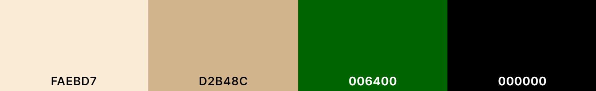
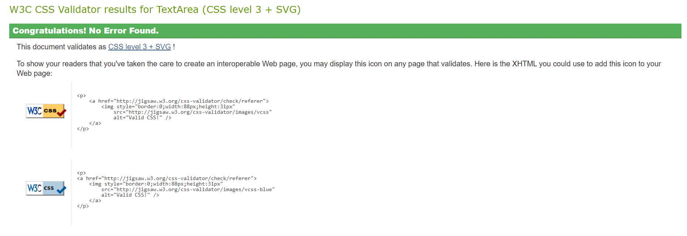
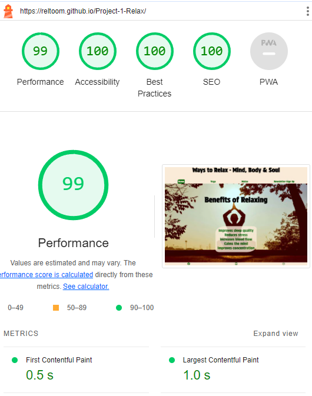

# Ways to Relax - Mind, Body & Soul

Visit the deployed site here: [Ways to Relax - Mind, Body & Soul](https://reltoom.github.io/Project-1-Relax/)

This site brings information about how to relax ones mind, body and soul. Follow along and read what the benefits of certain techniques are and how to do them. 
Yoga has spread worldwide and is being used by thousands of people to help them relax and strengthen their bodies. 
Watsu is relatively new form of relaxation/physical rehab that is done with another person in a pool of warm water.

## CONTENTS

* [User Experience](#user-experience-ux)
  * [User Stories](#user-stories)
* [Design](#design)
  * [Features](#features)
    * [The Home Page](#the-home-page)
    * [The Yoga Page](#the-yoga-page)
    * [The Watsu Page](#the-watsu-page)
    * [The Newsletter-Sign Up Page](#the-newsletter-sign-up-page)
    * [The Thank You Page](#the-thank-you-page)
    * [Colour Scheme](#colour-scheme)
    * [Typography](#typography)
    * [Future Implementations](#future-implementations)
* [Technologies](#technologies)
  * [Languages](#languages)
  * [Websites & Programs](#websites-programs)
* [Deployment](#deployment)
* [Testing](#testing)
   * [Validator Test](#validator-test)
   * [Bugs](#bugs)
* [Credits](#credits)
  * [Code Used](#code-used)
  * [Content](#content)
  * [Media](#media)
  * [Acknowledgments](#acknowledgments)

- - -
## User Experience (UX)

### User Stories

#### First Time Visitor Goals

* Easy to understand what the site is about or for.
* Easy to navigate and understand where links will go.
* Easy to follow lay out for comprehsion of site.
* Sign Up for newsletter works.

#### Returning Visitor Goals

* Layout is the same as before.
* Information is updated or expanded to provide new forms of relaxing or new techniques.

- - -

## Design

### Features

Ways to Relax consists of a home page, a 'Yoga' page, a 'Watsu' page, a 'Sign up for our Newsletter' page & a 'Thank you' for subscribing page.

The whole site is responsive and works just as well on mobile phones as desktop screens.

* There is a 'R' favicon in the browser tab for 'Relax'.

  

* The Header section includes the title: 'Ways to Relax - Mind, Body & Soul' as well as links to each of the other pages: 'Home', 'Yoga', 'Watsu' & 'Newsletter-Sign Up'. This is present on all pages of the site.

  

* The Footer section has links to Facebook, Youtube and Instagram (to the main site, not attached to actual accounts). Visible on all pages of the site.
 
  

#### The Home Page

The home page of 'Ways to Relax' highlights some of the many benefits of relaxing your body, mind & soul.

#### The Yoga Page

At the top of the Yoga page, the benefits of yoga are stated.

Next, the site shortly describes five different types of yoga: Yin Yoga, Vinyasa Yoga, Ashtanga Yoga, Yin Yang Yoga and Yoga Nidra.

A wide variety of Yoga positions are shown in the Yoga Positions section. Each pose comes with a short description of what benefits can be attained through that pose as well as an image of the pose so it is easier for you to do it yourself.

#### The Watsu Page

The first section on this page describes what Watsu is and what are the benefits of Watsu.

Next, 3 different Watsu excersises are displayed. A short description the excersise and some of the benefits followed by a picture of it in practice.

Lastly on the Watsu page, in the bottom right corner of the footer is a credit from where the images for Watsu are taken.

#### The Newsletter-Sign Up Page

On this page the user can sign up for a weekly newsletter from Ways to Relax. In this input form, the user is required to Enter a name and email address. Optional is a textarea where the user can tell more about themselves and their favorite way to relax. Pushing the 'Subscribe' button will take the user to the 'Thank You' page. The form itself is centered on a picture of a paper surrounded by sand and stones.

#### The Thank You Page

After subscribing to the 'Ways to Relax' newsletter, the user is taken to a page showing 'Thank you for subscribing to our newsletter!'. From here, the user can click any of the links in the header to return to the site.

### Colour Scheme

I wanted the color scheme to reflect natural colors and such that are related to relaxation. Calm and soothing tons reflecting sand or ground with green for plants and black for hightlights.

* `Antiquewhite` is used as the primary background color for the header section and text areas.
* `Darkgreen` is used for text areas, links in the header & footer and labels for the signup form.
* `Tan` is used for the general background color of the whole page.
* `Black` is used for the title and other headings.

  

### Typography

Two differenet fonts from Google Fonts were used for this site.

* For all titles or headings (black text) [Protest Strike](https://fonts.google.com/specimen/Protest+Strike?query=protest+strike) was used. This is a bolder style with smooth curves and easy readablilty. 

* All text areas (darkgreen text - exception is links and labels) have [Protest Riot](https://fonts.google.com/specimen/Protest+Riot?query=protest+riot). This is a smooth quill like style which reminded me of calligraphy.

### Future Implementations

1. Add descriptions of how to do each pose in the Yoga page.
2. Create a new page for Mindfulness with similar layout that the user is used to.
3. Add a 'Nearby You' section where you can locate Yoga or other forms of relaxation via Googlemaps.

- - -

## Technologies 

### Languages 

HTML & CSS were used in the making of Ways to Relax.

###  Websites & Programs 

* [Balsamiq](https://balsamiq.com/) - Created wireframes for basic outline and structure of site.
* [Github](https://github.com/) - Created repository and stored files here after commits.
* [Microsoft Visual Studio](https://visualstudio.microsoft.com/) - Wrote code and did commits to Github from here.
* [Google Fonts](https://fonts.google.com/) - Imports fonts for website.
* [Google Developer Tools](https://developer.chrome.com/docs/devtools) - For viewing in different screen resolution and finding errors.
* [TinyPNG](https://tinypng.com/) Compressed background images.
* [Favicon.io](https://favicon.io/) Created the 'R' favicon for webbrowser.
* [W3 School](https://www.w3schools.com/) Read and understand code.
* [Font Awesome](https://fontawesome.com/start) Footer icons for social media and the 3 bars icon for dropdown menu.
- - -

## Deployment 

Ways to Relax is deployed from Github Pages - [Ways to Relax - Mind, Body & Soul](https://reltoom.github.io/Project-1-Relax/).

To Deploy the site from GitHub Pages:

1. Go to the repository for this project and choose 'Settings'
2. From left side selection, go to 'Pages'.
3. Under 'Build and Deployment' from Source - choose 'Deploy from a branch'.
4. Under 'Branch', choose 'Main' from the first dropdown menu.
5. From the second dropdown menu, with the image of a folder, choose 'root', then save.

- - -

## Testing

Ways to Relax has been tested on: Chrome, Microsoft Edge and Safari.

With Dev Tools all standard screen sizes were tested to make sure the site looks good and is still readable. 

I had a couple of friends and my brothers test the website on their mobile phone just to make sure that it was not only working locally with me.

Links in the main menu take the user where expected. Links in the footer take you to the appropriate social media site.

The newsletter-sign up form requires a name and email address and when submitted, correctly takes the user to the 'Thank You' page.

## Validator Test

* HTML
    * Using the [W3C Validator](https://validator.w3.org/#validate_by_input), code was checked for each webpage to see if there were any errors.
    
* CSS
    * Using the [W3C Validator] (https://jigsaw.w3.org/css-validator/) the code for CSS was checked for errors.
    
* Accessibility 
    * Using the Lighthouse dev tool from Chrome; accessibitly, performace, best practices and SEO were tested.

### Bugs
Here are some of the bugs that came up during development. 

| Bug | Fix |
| :--- | :--- |
| Background images not showing when deployed. | Changed relative pathing to URL pathing ( "https://reltoom.github.io/Project-1-Relax/assets/images/mainbackground.jpg"))  |
| Text overflowing from background after border radius was entered. | Added padding of 10px or 15px where necessary to text container. |
| Submit from the newsletter form did not send user to the 'Thank You' page, gave error. | In the 'form' tag changed 'method' from 'post' to 'get'.
| Footer was moving up or down depending on content. | Used flex to add footer into correct space and then made the 'body' have a min-height of 100vh.|

Whenever I discovered a bug, I would go back to the course material and re-read the section to better understand. If that did not help me, I used Google to search for more info on the topic or possible solutions. If efter this I still was not able to solve an issue, I asked my brother form help ( he works as a programmer). He would point out what was causing the issues and from there I was able to figure out a solution.

There are no unsolved bugs.
- - -

## Credits

### Code Used
Most of the code I wrote myself with a lot of trial and error, saving and viewing on web browser. 

For the dropdown menu I used code from [Love Running](https://github.com/Code-Institute-Solutions/love-running-v3/tree/main/5.3-meetup-times) project to get main outline of it and then I adjusted the CSS for it for my own needs. Ideas for the Favicon and Social Media Icons are taken from [Love Running](https://github.com/Code-Institute-Solutions/love-running-v3/tree/main/5.3-meetup-times) as well.

### Content
Information about Yoga was taken from [Ekhartyoga](https://www.ekhartyoga.com/).

Information for Watsu was taken from a combination of [Healthline](https://www.healthline.com/health/watsu) and [Margoa Aquatic Bodywork](https://www.margoalv.com/).

### Media
Background images for the main page and the newsletter page are taken from [Pexels](https://www.pexels.com/).

Images for the Yoga page are self taken with my wife as the model.

Images for the Watsu page are with permission from  [Margoa Aquatic Bodywork](https://www.margoalv.com/).

### Acknowledgments

Thank you to my wife for modelling for yoga pictures and helping me format benefits of each different pose.
Thank you to my brother, Erik, for helping me find solutions to bugs or issues I was having with code.
Thank you to Margoa Aquatic Bodywork for giving me permission to use their pictures.
Thank you to my mentor from CI, Precious, for giving me advice and guidelines on the project.